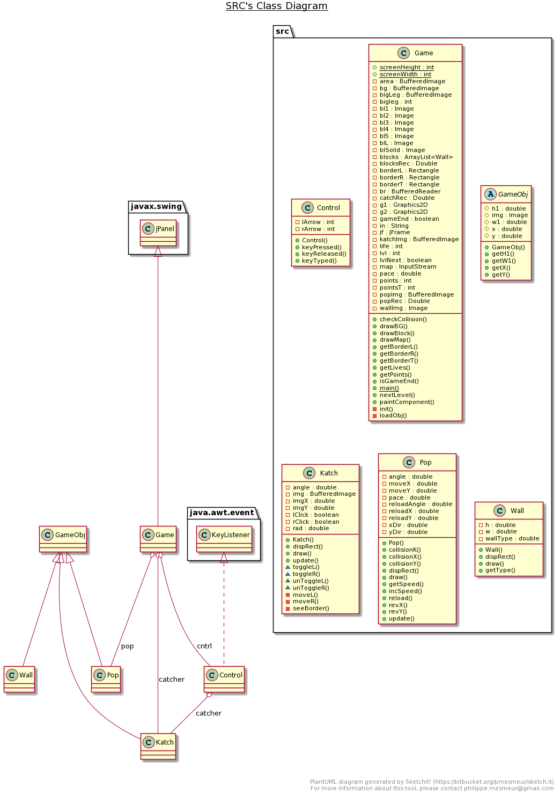

# Super-Rainbow-Reef-Game

## DESCRIPTION
The game has three levels, each containing several Big Legs that Pop must collide with to complete the level. Levels contain coral block defenses, which must be knocked out of the way in order to reach the Big Legs. Breaking blocks will score extra points and special blocks give the player extra rewards, but they don’t have to be destroyed to finish a level. If Pop leaves the screen, the player loses a life and Pop is brought back into play. Once three lives have been lost, the game ends and a high-score table is displayed. There is also a special extra life block in the game.

## DEVELOPMENT ENVIRONMENT
Version of JAVA Used: Java JDK 1.8.0_191 
IDE Used: IntelliJ IDEA 2020.2.3

## STEPS TO BUILD AND IMPORT 
Use the root folder to import the files directly into IntelliJ. 
In IntelliJ, go to "Project Structure -> Modules", and change the following settings. 
Set the Github repo as the Content Root. 
Set the TankGame/ SuperRainbowReef folder as a Source.  
Build the Tank class and the Game class in first and second game folder respectively. 
The jar file was built by adding Artifacts in the File/Project Structure dialog and declaring the root of the jar file. 
Then the artifact is built using the Build/Build Artifacts and the jar file is created which can be run by double clicking on it.

## STEPS TO RUN THE GAME
Right click on the "Tank" class or “Game” class depending on the game and select Run. 
The game starts immediately once launched. 
The games can also be run by launching the included .jar file via the command line located in the JAR folder or running the jar file in IntelliJ. 
The Super Rainbow Reef has three levels, each containing several Big Legs that Pop must collide with to complete the level. 
Breaking blocks will score extra points and special blocks give the player extra rewards. 
If Pop leaves the screen, the player loses a life and Pop is brought back into play. 
Once three lives have been lost, the game ends and a high-score table is displayed.  
There is also a special extra life block in the game. 
Use the Left and Right Arrow keys to move Katch in the respective direction to catch the Pop and Bounce it back on the Blocks.

## CLASS DESCRIPTION OF SECOND GAME (SUPER RAINBOW REEF)
* Control.java : Moves the Katch left or right accordingly to the arrow pressed.
* Game.java : This is the main class and is used to load all the sprites. To display the scores and stats, drawing blocks and biglegs, updating levels, checking collisions, loading background, etc.
* Katch.java : To load and define Katch and defining its controls.
* Pop.java : To update Pop and define its movement and projectile.
* Wall.java : To update Walls and drawing it on the screen.

## UML DIAGRAM

## GAMEPLAY
